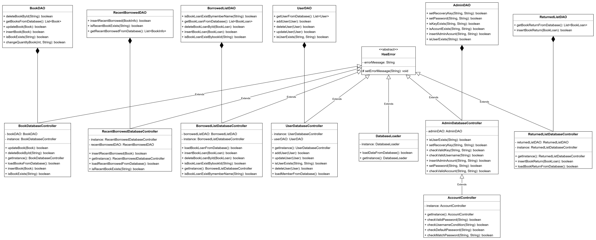
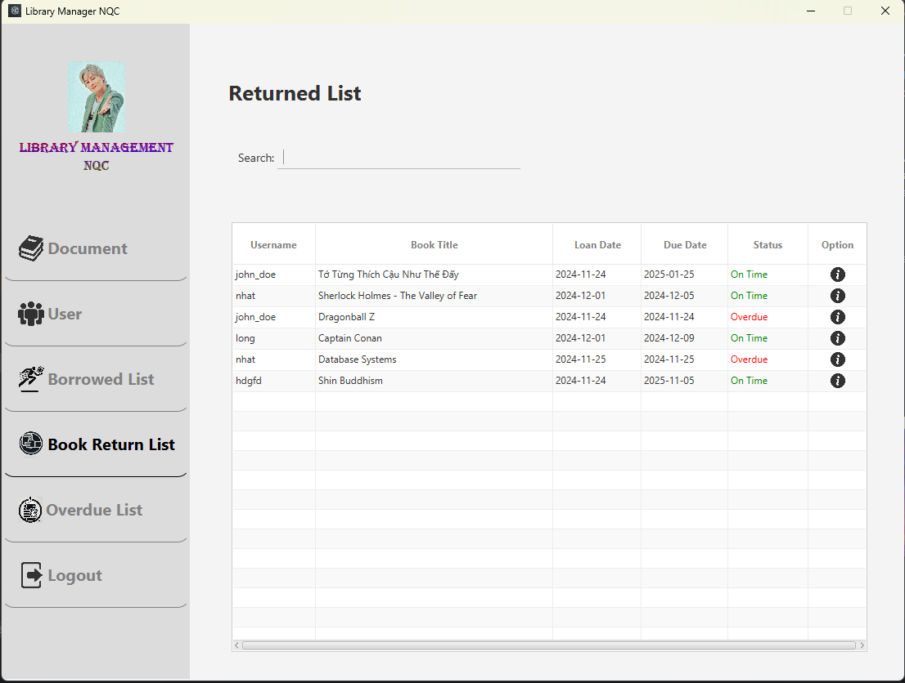

# Application to manager library using Java

## Author
Group NQC
1. Bui Duc Nhat - 23020128
2. Nguyen Viet Quang - 23020137
3. Nguyen Manh Cuong - 23020016

## Description
The application is designed to manage library operations efficiently. The application is written in Java and uses the JavaFX library. The application is based on the MVC model. The application use GoogleBookAPI to get book.

### Features include:
1. Managing a catalog of books (add, edit, delete, search).
2. Managing user accounts (add, update, delete).
3. Borrowing and returning books.
4. Tracking overdue books.
5. Getting data from GoogleBookAPI

## UML diagram

## Installation
1. Clone the project from the repository.
2. Open the project in the IDE.
3. Setup jdk and add libraries
4. Run the project.

## Usage
### Book Management
- **View book list**: Click "Document" to view all books.
- **Search for a book**: Click the "Add Book" icon, Enter the book title, author, or ISBN in the search bar, and results will appear in the list.
- **Add a book**: Select a book from the search list, click "Add Book" icon, fill in the book details, and click "Add".
- **Edit a book**: Select a book from the list, click "Edit Book" icon, modify the details, and save.
- **Delete a book**: Select a book from the list and click "Delete" icon.

### User Management
- **View user list**: Click "User" to view all users.
- **Register a new user**: Click "Add User" icon, enter the user’s details, and save.
- **Update user information**: Select a user, click "Edit User" icon, modify the details, and save.
- **Delete a user**: Select a user and click "Delete" icon.

### Borrowing Books
- **View borrow list**: Click "Borrowed List" to view all transactions.
- **Borrow a book**: Select a user, and click "Borrow" icon, choose a book, fill in the transactions details. The system will record the borrowing date.

### Returning Books
- **View return list**: Click "Return List" to view all transactions.
- **Return a book**: Select the transaction and click "Return" icon, fill in the transactions details. The system will update the status of the book.

### Overdue Management
- **Check overdue books**: Click "Overdue List" to see all overdue transactions.

### Logout the Application
- Click the "**Logout**" button to log out.

## Demo
+ **Login**  
  

+ **Book Information**  
  

+ **Add Book**  
  

+ **Edit User**  
  

+ **Borrow Books**  
  

+ **Return Books**  
  

+ **Overdue Management**  
  

## Future Improvements
1. Integrate a database for better data management.
2. Enhance search functionality with advanced filters.
3. Add analytics to track library usage statistics.
4. Integrate email notifications for overdue reminders.
5. Develop a mobile-friendly version.

## Contributing
Pull requests are welcome. For major changes, please open an issue first to discuss what you would like to change.

## Project Status
The project is functional but open for further improvements.

## Notes
The application is written for educational purposes.